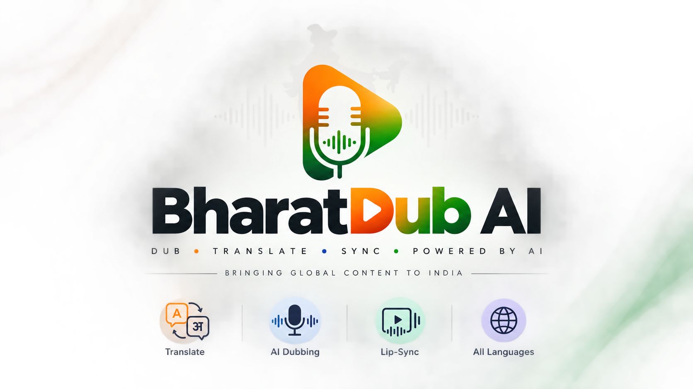

<div align="center">


# 🇮🇳 BharatDub AI

**AI-powered multilingual video dubbing with a focus on Indian-language accessibility — starting with Hindi.**

BharatDub AI is an end-to-end video dubbing pipeline. Provide a local video or YouTube URL, choose the source and target languages, and the system transcribes, translates, clones the speaker's voice, preserves background audio, synchronizes the dubbed speech, and optionally performs lip-sync.

</div>

---

## ✨ Highlights

- 🎬 YouTube or local video input
- 🌐 Multilingual translation and dubbing
- 🇮🇳 Hindi (`hi`) support — default target language
- 🗣️ Speaker voice cloning with XTTS v2
- 👥 Speaker diarization with `pyannote.audio`
- 🎭 Optional emotion analysis with SpeechBrain
- 👄 Optional Wav2Lip lip synchronization
- 🔊 Background music / ambient sound preservation
- 🧠 MarianMT translation with optional LLM enhancement
- 🖥️ Gradio web interface
- ⚡ CUDA GPU acceleration

---

## 🎥 What It Does

```
Video / YouTube URL
        ↓
Audio Extraction
        ↓
Speaker Diarization
        ↓
Speech-to-Text (Whisper)
        ↓
Sentence Segmentation (NLTK)
        ↓
Translation (MarianMT / optional LLM)
        ↓
Emotion Analysis (optional)
        ↓
Voice Synthesis & Voice Cloning (XTTS v2)
        ↓
Audio Synchronization + Background Sound
        ↓
Optional Lip-Sync (Wav2Lip)
        ↓
🎉 Final Dubbed Video
```

---

## 🌍 Supported Languages

| Language | Code |
|---|---|
| English | `en` |
| Spanish | `es` |
| French | `fr` |
| German | `de` |
| Italian | `it` |
| Turkish | `tr` |
| Russian | `ru` |
| Dutch | `nl` |
| Czech | `cs` |
| Arabic | `ar` |
| Chinese (Simplified) | `zh-cn` |
| Japanese | `ja` |
| Korean | `ko` |
| **Hindi** | **`hi`** |
| Hungarian | `hu` |

> Hindi is the primary Indian-language focus of BharatDub AI and is configured as the default target language. See [`LANGUAGE_SUPPORT.md`](LANGUAGE_SUPPORT.md) for additional details.

---

## 🧠 Pipeline

| Stage | Technology | Purpose |
|---|---|---|
| 🎬 Video Input | `yt-dlp` / local file | Obtain the source video |
| 👥 Speaker Diarization | `pyannote.audio` | Detect who is speaking and when |
| 🎙️ Transcription | Whisper / Faster-Whisper | Convert speech into text |
| ✂️ Segmentation | NLTK | Split dialogue into sentence segments |
| 🌐 Translation | MarianMT | Translate dialogue |
| 🧠 Optional Translation | Groq / LLM | Improve contextual phrasing |
| 🎭 Emotion | SpeechBrain | Analyze speech emotion |
| 🗣️ Voice Synthesis | XTTS v2 | Generate translated speech |
| 👄 Lip-Sync | Wav2Lip | Synchronize mouth movement |
| 🎞️ Video Processing | OpenCV | Face/frame processing |
| 🔊 Audio Mixing | PyDub | Mix generated and background audio |
| 🎬 Media Processing | FFmpeg | Synchronize and export media |
| 🖥️ Interface | Gradio | Browser-based application |

---

## 🚀 Installation

### Requirements

- Python 3.10.x
- Git
- FFmpeg
- NVIDIA GPU + CUDA recommended
- Hugging Face account/token (for speaker diarization)
- Optional Groq API key (for LLM-based translation)

> CPU execution is possible, but AI processing can be significantly slower.

### 1. Clone the repository

```bash
git clone https://github.com/Neerajborayan1628/BharatDub-AI.git
cd BharatDub-AI
```

### 2. Create the environment

**Python venv**

```bash
python -m venv .venv
```

Windows:
```powershell
.\.venv\Scripts\Activate.ps1
```

Linux/macOS:
```bash
source .venv/bin/activate
```

### 3. Install FFmpeg

**Windows**
```powershell
winget install --id Gyan.FFmpeg.Shared -e
```

**Ubuntu/Debian**
```bash
sudo apt update
sudo apt install ffmpeg
```

Verify:
```bash
ffmpeg -version
```

### 4. Install dependencies

```bash
pip install -r requirements.txt
```

### 5. Configure environment variables

Create a `.env` file in the project root:

```
HF_TOKEN=your_huggingface_token
Groq_TOKEN=your_groq_token
```

- `HF_TOKEN` — required for the Hugging Face speaker-diarization models.
- `Groq_TOKEN` — optional; enables the optional LLM/context-aware translation path.

> ⚠️ Never commit `.env` or API keys to GitHub.

### 6. GPU setup

For a CUDA 12.1 PyTorch environment:

```bash
pip install torch torchvision torchaudio --index-url https://download.pytorch.org/whl/cu121
```

Verify:
```python
import torch

print("PyTorch:", torch.__version__)
print("CUDA available:", torch.cuda.is_available())

if torch.cuda.is_available():
    print("GPU:", torch.cuda.get_device_name(0))
```

---

## ▶️ Usage

### Option 1 — Gradio Web App

```bash
python app.py
```

Open: **http://127.0.0.1:7860**

The web interface lets you configure:
- Input video
- Source language
- Target language
- Whisper model
- Lip-sync
- Background sound preservation

### Option 2 — Command Line

English → Hindi example:

```bash
python inference.py --yt_url "https://www.youtube.com/shorts/ULptP9egQ6Q" --source_language "en" --target_language "hi" --LipSync True --Bg_sound True
```

**Arguments**

| Argument | Description |
|---|---|
| `--yt_url` | YouTube video URL |
| `--video_url` | Source/local video |
| `--source_language` | Source language code |
| `--target_language` | Target language code |
| `--whisper_model` | Whisper model |
| `--LipSync` | Enable or disable lip synchronization |
| `--Bg_sound` | Preserve original background sound |

Output files are saved under `results/`.

---

## 👄 Wav2Lip Lip-Sync

Lip-sync is optional.

- Before enabling lip-sync, download/configure the required Wav2Lip weights according to the Wav2Lip setup instructions.
- If you don't need lip-sync, leave the option disabled and use the normal dubbing pipeline.

---

## 🔊 Background Sound Preservation

BharatDub AI can attempt to preserve original:
- 🎵 Music
- 🌆 Ambient sound
- 🔊 Environmental audio

while replacing the original spoken dialogue with generated dubbed speech.

Enable with `Bg_sound = True`. Results depend on how speech and background audio are mixed in the source video.

---

## 🎭 Emotion-Aware Synthesis

SpeechBrain can analyze individual speech segments and classify emotions such as:
- 😐 Neutral
- 😊 Happiness
- 😢 Sadness
- 😠 Anger

The detected emotion can be used during voice synthesis to make the generated dubbing more expressive.

---

## 🗣️ Voice Cloning

BharatDub AI uses XTTS v2 to generate translated speech based on the source speaker's voice characteristics.

```
Original Speaker
      ↓
Reference Audio
      ↓
XTTS v2
      ↓
Translated Speech
      ↓
Dubbed Video
```

> Use voice cloning only when you have the appropriate permission to use the speaker's voice.

---

## 📁 Project Structure

```
BharatDub-AI/
│
├── app.py
├── inference.py
├── requirements.txt
├── LANGUAGE_SUPPORT.md
├── verify_hindi_support.py
├── README.md
├── LICENSE
│
├── tools/
│   └── utils.py
│
├── Wav2Lip/
│   ├── inference.py
│   ├── face_detection/
│   ├── evaluation/
│   └── ...
│
└── images/
    └── bharatdub_ai_logo.png
```

> Large videos, generated audio, model weights, virtual environments, and secrets should remain outside Git.

---

## 🧪 Hindi Support Verification

```bash
python verify_hindi_support.py
```

This verifies the project's Hindi language configuration.

---

## 🛠️ Troubleshooting

**`ffmpeg` is not recognized**
```bash
ffmpeg -version
```
If it fails, install FFmpeg and make sure its `bin` directory is available through your system PATH.

**CUDA is unavailable**
```python
import torch
print(torch.cuda.is_available())
```
If it returns `False`, check your NVIDIA driver and PyTorch CUDA installation.

**Hugging Face authentication error**
- Check that `HF_TOKEN` is correct.
- Required model terms have been accepted.
- Your Hugging Face account has access to the required `pyannote` models.

**Lip-sync fails**
Make sure the required Wav2Lip model weights are installed/configured before enabling lip-sync.

**Processing is slow**
A CUDA-enabled NVIDIA GPU is strongly recommended. CPU processing can be significantly slower.

---

## 🔐 Responsible Use

BharatDub AI can clone voices and modify visible lip movement. Please use the technology responsibly:

- Obtain permission before cloning someone's voice or likeness.
- Do not use the system for impersonation, fraud, or deception.
- Respect copyright when downloading or modifying videos.
- Do not process private recordings without appropriate authorization.
- Follow applicable copyright, privacy, and data-protection laws.
- Clearly disclose AI-generated or AI-dubbed content where appropriate.

---

## 📚 Acknowledgements

BharatDub AI builds on open-source technologies and research from the speech, translation, and video communities, including:

- [Wav2Lip](https://github.com/zabique/Wav2Lip)
- [pyannote.audio](https://github.com/pyannote/pyannote-audio)
- Whisper / Faster-Whisper
- SpeechBrain
- XTTS
- MarianMT
- OpenCV
- FFmpeg
- PyDub
- NLTK
- Gradio
- yt-dlp

Please respect the licenses and terms of the individual third-party projects and models used by BharatDub AI.

---

## 📄 License

See [`LICENSE`](LICENSE) for the project license.

Third-party models and components may have separate licenses and terms.

---

<div align="center">

**🇮🇳 BharatDub AI**
*Multilingual AI video dubbing — with Hindi at the heart of the project.*

</div>